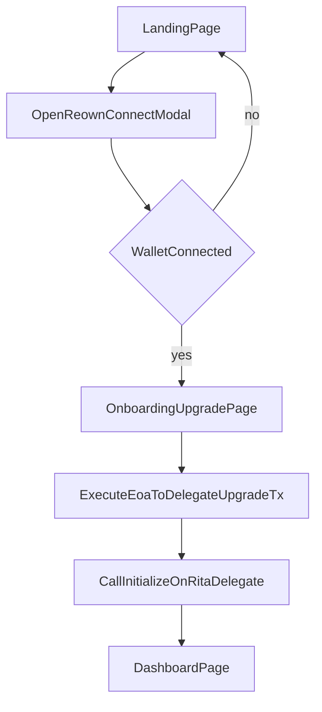

# Streamlined Wallet Onboarding Plan

## Goal
Replace the current 3-step onboarding (`connect -> upgrade -> install`) with a 1-step wallet connect + 1-step upgrade flow:
- `LandingPage` buttons open Reown wallet UI directly.
- Connected users proceed to `OnboardingUpgradePage`.
- `Sign and Upgrade` performs EOA->delegate smart-account upgrade against Rita delegate contract on Lisk Sepolia (`chainId: 4202`, delegate: `0xFD055766aF5DC43eAC17a0fBf8A5f520dBE49316`).
- After successful upgrade transaction + initialization, users navigate directly to dashboard.

## Files To Change
- [apps/web/src/pages/LandingPage.tsx](apps/web/src/pages/LandingPage.tsx)
- [apps/web/src/pages/OnboardingUpgradePage.tsx](apps/web/src/pages/OnboardingUpgradePage.tsx)
- [apps/web/src/main.tsx](apps/web/src/main.tsx)
- [apps/web/src/lib/web3/appkit.ts](apps/web/src/lib/web3/appkit.ts)
- [apps/web/src/lib/contracts/abi.ts](apps/web/src/lib/contracts/abi.ts)
- [apps/web/src/lib/contracts/hooks.ts](apps/web/src/lib/contracts/hooks.ts)
- Remove references/routes for:
  - [apps/web/src/pages/OnboardingConnectPage.tsx](apps/web/src/pages/OnboardingConnectPage.tsx)
  - [apps/web/src/pages/OnboardingInstallPage.tsx](apps/web/src/pages/OnboardingInstallPage.tsx)

## Implementation Steps
1. Update chain + wallet config for Lisk Sepolia
- Extend AppKit/wagmi network config in `appkit.ts` to include Lisk Sepolia (`4202`) so Reown modal connects on intended chain.
- Ensure chain mismatch handling (button state + clear prompt) in onboarding upgrade UI.

2. Remove connect/install route steps
- In `main.tsx`, delete route definitions and route tree entries for `/onboarding/connect` and `/onboarding/install`.
- Keep `/onboarding/upgrade` and `/app/dashboard` routes.

3. Trigger Reown modal from landing CTA/buttons
- In `LandingPage.tsx`, replace links to `/onboarding/connect` with direct wallet modal open using `useAppKit().open({ view: 'Connect' })`.
- After successful connection, navigate to `/onboarding/upgrade`.
- Keep UX resilient when modal is unavailable (missing project id).

4. Implement real upgrade action on `OnboardingUpgradePage`
- Replace current sign-only flow with:
  - user signature/authorization step (if required by chosen 7702 tx pattern),
  - transaction that upgrades EOA behavior to use Rita delegate contract `0xFD055766aF5DC43eAC17a0fBf8A5f520dBE49316` on chain `4202`,
  - immediate `initialize(...)` call on delegate context.
- For initialize input defaults (per your choice):
  - `heirs = [connectedWalletAddress]`
  - `threshold = project default constant` (set as constant/env-backed value)
  - `coreStables = project default list` (set as constants/env-backed array)
- Add clear loading/progress/error states for each transaction stage.

5. Wire/extend contract helpers
- Add required ABI entries for initialization/upgrade interactions in `abi.ts` (if not already present).
- Add/update helper hook(s) in `hooks.ts` to execute upgrade + initialize transactions with receipt waiting and typed errors.

6. Navigate straight to dashboard
- On successful upgrade + initialize, route directly to `/app/dashboard` from `OnboardingUpgradePage`.
- Remove any remaining navigation references to `/onboarding/install`.

7. Cleanup dead onboarding files/usages
- Remove imports/usages of `OnboardingConnectPage` and `OnboardingInstallPage` from runtime router setup.
- Optionally delete unused route stub files under `src/routes/onboarding/*` if they are no longer referenced.

8. Validation pass
- Verify landing button behavior (both `Launch App` and `Connect Wallet`).
- Verify connect -> upgrade -> dashboard flow on Lisk Sepolia.
- Verify failure paths: rejected signature, rejected tx, wrong chain, missing wallet/project id.

## Flow Diagram

## Notes
- Contract details provided: Rita delegate at `0xFD055766aF5DC43eAC17a0fBf8A5f520dBE49316`.
- Network target provided: Lisk Sepolia (`4202`).
- If the exact 7702 transaction encoding is not yet represented in repo helpers, the implementation will add a dedicated utility module for deterministic tx construction and signing.